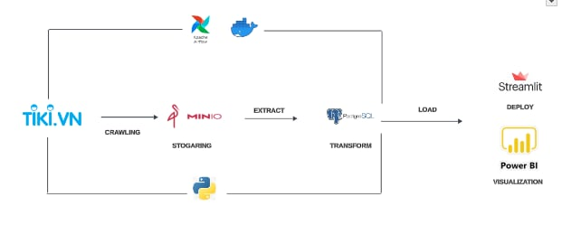

# 🌄 Category Analysis on the Tiki E-commerce Platform

The product catalog contains 400 items. Data is crawled daily and stored in the Data Lake(MinIO/S3).
The ETL (Extract-Transform-Load) process moves the data into the Data Warehouse(Postgres). The processed data is
then transferred to PowerBI for visualization and to Streamlit to deploy Machine Learning models.

## 🔦 About Project

- **Data Source**: This project uses one main `data sources`: [Tiki  API]
   - `Tiki API`: Data is collected from `Tiki API` using the `request` library, collected in `batch time` with an interval between data points of `1 day`, collected data includes indicators such as `Price`, `Rating`, `Quantity Sold`, `Datetime`,...
 - **Stogaring**: After being collected, data will be written to `MinIO/S3` with different `topics` for each different `data source`.
 - **ETL Data**: After data is sent to `MinIO/S3`, it will be read and retrieved using `Python`  to process , perform `ETL` from `MinIO/S3` to `Data Warehouse(Postgres)`  
 - **Visualize and deploy Data**: At the same time, when the data is processed, it will be loaded directly into the `PowerBI` to perform analyst, other source perform trainning model and deploy to the website application by `Streamlit`.

 - **package and orchestration**: Components are packaged using `Docker` and orchestrated using `Apache Airflow`.

## 📦 Technologies
- 'Python'
-'Airflow'
-'Docker'
-'Streamlit'
-'PowerBI'
-'PostgreSQL'
-'MinIO/S3'
-'Machine Learning'